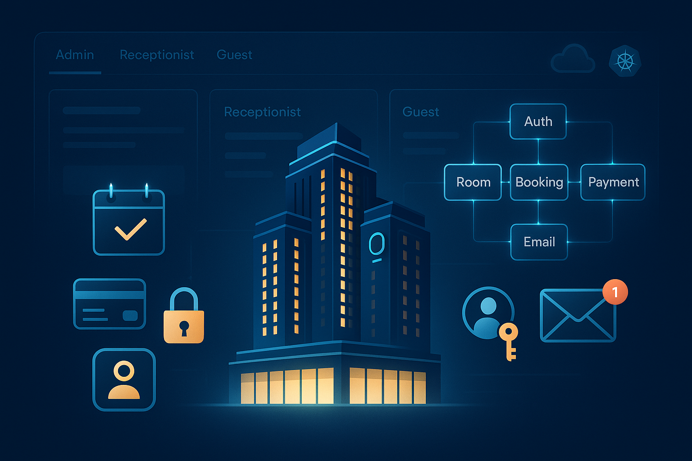
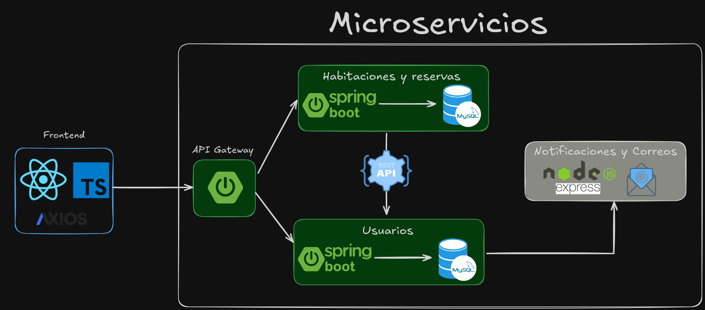

<h1 align="center">🚀 Hotel Reservation System (LUXUTY HOTEL)</h1>

Una plataforma de reservas de hotel estilo “Airbnb” que permite a los usuarios gestionar habitaciones, 
pagos y recibir confirmaciones por correo electrónico, y a los administradores controlar inventario, 
precios y usuarios con roles específicos.

---

## 🏗️ Arquitectura de Microservicios

Se decidió crear el proyecto utilizando una arquitectura de microservicios, que actualmente
es una de las más utilizadas en la industria del desarrollo web, proporcionando varias ventajas
con respecto a la arquitectura monolítica que normalmente se realiza cuando estamos creando
proyecto de ejemplo.

### Ventajas

El uso de microservicios da como resultado sistemas más escalables, flexibles y fáciles de mantener. 
Algunas de las ventajas que proporciona esta arquitectura son:

1. **Acelera la escalabilidad**
2. **Mejora el aislamiento de los fallos**
3. **Mejora la productividad del equipo**
4. **Acorta el tiempo de implementación**
5. **Costes más eficientes**

### Desventajas

Aunque esta arquitectura proporciona ventajas significativas para mantener aplicaciones, también
presenta desafios y retos a la hora de implementarla, algunos de estos desarios son:

1. **Mayor complejidad:** Como son microservicios son distribuidos, gestionar la comunicación
puede llegar a ser difícil.

2. **Dificultades con la depuración:** puede resultar difícil depurar una aplicación que 
contiene varios microservicios, cada uno con su propio conjunto de registros.

3. **Dificultades de implementación y control de versiones:** El coodinar el versionado y las 
implementaciones pueden llegar a ser un desafio bastante 
complejo si no hay una buena gestión de los mismos.

---

## 🛠️ Tecnologías y Herramientas

- **Backend:** Java + Spring Boot
- **Frontend:** React con TypeScript y Axios para peticiones HTTP
- **Base de Datos:** MySQL
- **Seguridad:** JWT para autenticación y autorización por roles
- **Mensajería:** Node.js con Express para el envío de correos (SMTP)
- **Infraestructura:** Docker, MicroK8s + Ingress con TLS
- **Control de versiones:** Git + GitHub
- **Principios de diseño:** SOLID, Clean Code, patrones de diseño
- **Comunicación:** Meet, WhatsApp

---

## 📦 Funcionalidades Principales

Algunas de las funcionalidades principales del proyectos son

## Visualización de perfil e historial de reservas

Los usuarios tienen un apartado de **Profile** donde pueden ver su información personal, 
con posibilidad de modificarla. También información del hisotial de las reservas realizadas por él.

Cada reserva tiene diferentes estados para poder ver visualmente cuales están **activas**, 
**confirmadas**, **completadas** y **canceladas**

## Búsqueda y reserva de habitaciones

Los usuarios van a poder buscar y filtrara habitaciones dependiendo de la **capacidad**, 
**tipo de habitación** y **comodidades**

## Panel de recepcionista 

Un panel especial para el **recepcionista** del hotel, cual será el encargado de realizar **Check-in**
y **Check-out** a los huéspedes del hotel

### Check-in

Para la parte del **check-in** el recepcionista pedirá un código de 6 carácteres alfanumérico que 
se envía al correo electrónico del huésped a la hora en la que realizó la reserva de la habitación.

### Check-out

Para la parte del **check-out** el recepcionista busca por nombre o por número de identidad, 
la lista de usuarios que están activos en el hotel (los que ya realizaron **check-in**)

## Otras funcinaliades

- Registro e inicio de sesión de huéspedes
- Reserva de habitaciones
- Gestión de pagos y envío automático de confirmaciones por correo (Proximamente)
- Panel de administrador para:
    - Control de inventario de habitaciones
    - Ajuste de precios y disponibilidad
    - Gestión de usuarios y asignación de roles (Administrador, Recepcionista)
- Arquitectura basada en microservicios desacoplados

---

## Autores
| [ Jorge Gutiérrez](https://github.com/JorgeGutierrez11) | [ Mauricio Marin](https://github.com/Maicio3004) |
|:------------------------------------------------------------------------------------------------------------------------------------------------:|:------------------------------------------------------------------------------------------------------------:|

Ambos integrantes trabajaron de forma conjunta tanto en el Frontend como en el Backend.
Adquiriendo conocimientos de ambos sectores para poder reforzar conocimientos de forma práctica.